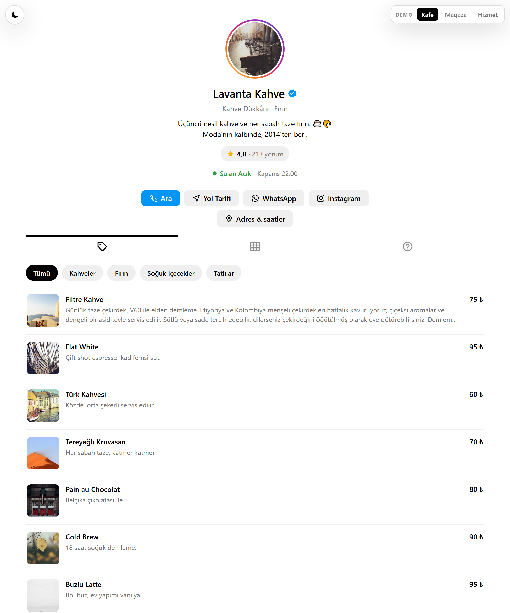
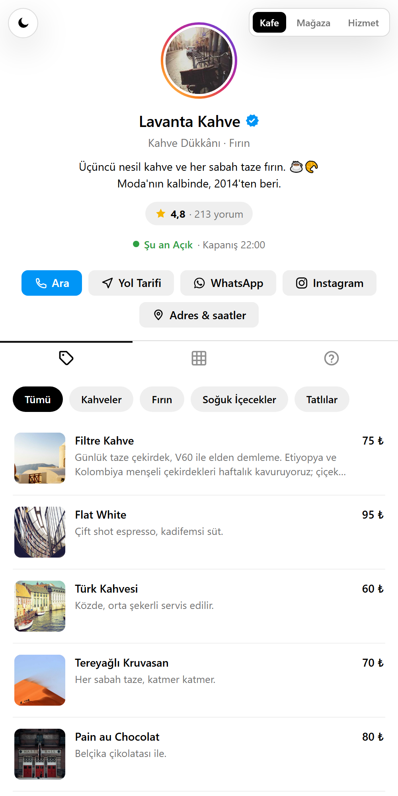

# insta-business-profile

Bir işletmeyi Instagram profili gibi gösteren, **tek dosya veriyle yapılandırılan statik web sayfası**.
Sunucu, build adımı, bağımlılık yok — `index.html`'e çift tıkla açılır.

**🔗 Canlı demo: [mertkilic0111.github.io/insta-business-profile](https://mertkilic0111.github.io/insta-business-profile/)**

Demo üç farklı işletme tipini içerir; sağ üstteki `DEMO` seçicisinden geçiş yapabilirsiniz:

| Demo | İşletme | Katalog düzeni |
|---|---|---|
| [Kafe](https://mertkilic0111.github.io/insta-business-profile/#menu) | Lavanta Kahve | `menu` — fiyat listesi satırları |
| [Mağaza](https://mertkilic0111.github.io/insta-business-profile/#product) | Mira Mücevher | `product` — ürün kartı ızgarası |
| [Hizmet](https://mertkilic0111.github.io/insta-business-profile/#service) | Ink & Soul Studio | `service` — süre + fiyat satırları |

| Geniş ekran | Dar ekran (mobil düzen) |
|:--:|:--:|
|  |  |

---

<details open>
<summary><b>English summary</b></summary>

A **static, zero-dependency business profile page** styled after Instagram. Everything a business
needs on one page: logo, bio, rating badge, live open/closed status, contact actions, a product /
menu / service catalog with a WhatsApp cart, a 4:5 post grid with infinite scroll, Google-style
reviews and an FAQ.

- **No server, no build, no framework.** Plain HTML/CSS/JS; runs straight off `file://`.
- **One data file.** Edit `data/profile.js` — nothing else. Sections switch themselves on and off
  based on the `modules` flags and whether the data exists.
- **Fits any business type.** The catalog renders as a product grid, a menu list or a service list
  from a single `layout` value.
- **Ordering without a backend.** The cart lives in `localStorage` and produces one pre-filled
  `wa.me` message — with a preview and an explicit confirmation step, never a one-click send.
- **Light / dark theme**, follows the system preference with a manual toggle stored in
  `localStorage`.
- **Responsive by behaviour, not just by width.** Desktop opens posts in a side-by-side modal with
  arrows; mobile opens a vertical feed with a back button.

Live demo: **[mertkilic0111.github.io/insta-business-profile](https://mertkilic0111.github.io/insta-business-profile/)** · License: MIT

</details>

---

## Özellikler

**Profil başlığı**
- Logo, işletme adı, doğrulama rozeti, kategori, çok satırlı biyografi
- Yorumları açan tıklanabilir puan rozeti (⭐ 4,8 · 213 yorum)
- Çalışma saatlerinden **canlı hesaplanan Açık / Kapalı** durumu

**İletişim**
- Ara · Yol Tarifi · WhatsApp · Instagram aksiyon butonları (yalnızca dolu olan alanlar çıkar)
- "Adres & saatler" bottom-sheet'i: adres, telefon, e-posta ve haftalık saat tablosu

**Sekmeler** (yalnızca verisi olanlar görünür)
- **Ürünler / Menü / Hizmetler** — üç katalog düzeni, koleksiyon filtreleri, varyant seçimi
- **Gönderiler** — 4:5 ızgara, iskelet (skeleton) yükleme, sonsuz kaydırma (sayfa başına 6 gönderi)
- **S.S.S.** — açılır-kapanır soru listesi

**Gönderi görüntüleyici**
- Masaüstü: yan-yana modal, ok tuşlarıyla gezinme, `Esc` ile kapatma
- Mobil: dikey akış, geri butonu, tarayıcı geri tuşuyla kapanma
- `image` · `gallery` (kaydırmalı karusel) · `video` (sessiz + döngülü otomatik oynatma, tıklayınca ses açılır)

**Sipariş akışı (backend'siz)**
- Sepet `localStorage`'da tutulur, sayfa yenilense de kaybolmaz
- Dipte sabit sepet çubuğu: adet, toplam tutar
- Sepet sheet'i: her kalem için önizleme + adet/silme + temizleme
- Tek ön-dolu **WhatsApp** mesajı üretilir — **tek tıkla gönderim yok**, önce önizleme + onay
- Katalogda WhatsApp numarası yoksa sipariş akışı tamamen kapanır (tek gate fonksiyonu)

**Diğer**
- Google tarzı yorumlar: yıldız dağılımı, renkli baş harf avatarları, göreli tarih ("3 hafta önce")
- Sol üstte tema düğmesi (açık / koyu), tercih `localStorage`'da
- Her yerde aynı iskelet (shimmer) deseni: ızgara, katalog, yorumlar, modal medyası
- Tüm kullanıcı verisi çıktı anında escape edilir (XSS)
- Semantik işaretleme: `role="dialog"` + `aria-modal` + `aria-label`; modal ve sheet'ler `Esc` ile
  kapanır. (Not: modal'larda odak tuzağı/odak yönetimi henüz yok.)

---

## Hızlı başlangıç

```bash
git clone https://github.com/mertkilic0111/insta-business-profile.git
cd insta-business-profile
```

Sonra `index.html` dosyasına çift tıklayın. Hepsi bu — sunucu gerekmez.

Yayına almak için klasörü olduğu gibi herhangi bir statik hosting'e kopyalayın
(GitHub Pages, Netlify, Vercel, cPanel, paylaşımlı hosting…).

---

## Dosya yapısı

```
index.html                    iskelet + sürümlü (?v=) asset bootstrap
data/profile.js               TÜM veri (window.PROFILE) — düzenlemeniz gereken tek dosya
assets/js/icons.js            inline SVG ikon seti (window.ICONS)
assets/js/app.js              render + etkileşim
assets/css/custom.css         tek CSS dosyası; Instagram paleti, açık/koyu tema
.github/workflows/pages.yml   main'e her push'ta GitHub Pages'e dağıtır
```

Her sorumluluk **tek bir kaynakta**: veri sadece `profile.js`'te, ikonlar sadece `icons.js`'te,
stil sadece `custom.css`'te.

---

## Yapılandırma

Tüm içerik `data/profile.js` içindeki tek bir nesneden gelir:

```js
window.PROFILE = {
  name: 'Lavanta Kahve',
  username: 'lavantakahve',
  category: 'Kahve Dükkânı · Fırın',
  verified: true,
  logo: 'assets/img/logo.jpg',          // yerel dosya ya da URL
  bio: 'Üçüncü nesil kahve. ☕\nModa\'da, 2014\'ten beri.',

  modules: { posts: true, catalog: true, reviews: true, faq: true },

  contact: {
    address: 'Caferağa Mah. Moda Cad. No:12, Kadıköy / İstanbul',
    phone: '+902165550123',             // tel: bağlantısı için ham numara
    phoneLabel: '+90 216 555 01 23',    // ekranda gösterilen biçim
    email: 'merhaba@ornek.com',
    hours: {                            // kapalı gün için null
      mon: ['07:00', '22:00'], tue: ['07:00', '22:00'], wed: ['07:00', '22:00'],
      thu: ['07:00', '22:00'], fri: ['07:00', '22:00'], sat: ['09:00', '23:00'],
      sun: null
    },
    maps: 'https://www.google.com/maps/search/?api=1&query=...'
  },

  social: {
    instagram: 'https://instagram.com/kullaniciadi',
    whatsapp: 'https://wa.me/902165550123'   // sipariş akışını açan alan
  },

  order: { intro: 'Merhaba, aşağıdaki siparişi vermek istiyorum:' },

  catalog: { /* aşağıya bakın */ },
  reviews: { /* aşağıya bakın */ },
  faq:     [ { q: 'Soru?', a: 'Cevap.' } ],
  posts:   [ /* aşağıya bakın */ ]
};
```

### `modules` — bölümleri aç/kapat

`posts` · `catalog` · `reviews` · `faq`. Bir bayrağı `false` yapmak o bölümü kapatır;
**verisi olmayan bölüm zaten görünmez**, yani çoğu zaman `modules`'a hiç dokunmanız gerekmez.

### `catalog` — üç düzen, tek şema

```js
catalog: {
  layout: 'product',            // 'product' | 'menu' | 'service'
  title: 'Ürünler',             // sekme etiketi
  currency: '₺',
  cartVerb: 'Sepete Ekle',      // 'Randevu Listesine Ekle' gibi değiştirilebilir
  collections: [                // sekme içi filtreler (isteğe bağlı)
    { id: 'rings', name: 'Yüzükler' }
  ],
  items: [
    {
      id: 'r1',                        // zorunlu, benzersiz
      name: 'Ay Işığı Yüzük',          // zorunlu
      collection: 'rings',
      price: 1450,                     // sayı → para birimiyle biçimlenir
      priceText: 'Tasarıma göre',      // price yerine serbest metin (sepete eklenmez, toplamı bozmaz)
      oldPrice: 1990,                  // üstü çizili gösterilir
      badge: 'İndirim',                // küçük etiket
      duration: '1 saat',              // 'service' düzeninde gösterilir
      desc: 'Uzun açıklama…',
      media: ['url1.jpg', 'url2.jpg'], // ilk görsel kapak, gerisi karusel
      variants: [
        { label: 'Beden', options: ['10', '12', '14'] },
        { label: 'Renk',  options: ['Gümüş', 'Altın Kaplama'] }
      ]
    }
  ]
}
```

`cartVerb` yalnızca buton metnini değil, tıklama sonrası geri bildirimini de belirler:
"Randevu Listesine Ekle" → "Randevu Listesine Eklendi".

### `posts` — 4:5 ızgara

```js
posts: [
  { id: 'p1', type: 'image',   media: ['foto.jpg'], caption: 'Açıklama', location: 'Moda', date: '2026-05-29' },
  { id: 'p2', type: 'gallery', media: ['a.jpg', 'b.jpg', 'c.jpg'], caption: '…', date: '2026-05-28' },
  { id: 'p3', type: 'video',   media: ['kapak.jpg'], video: ['klip.mp4'], caption: '…', date: '2026-05-26' }
]
```

`type`: `image` · `gallery` · `video`. Video gönderilerinde `media` poster görselidir,
`video` ise kaynak listesidir (birden fazla yazarsanız ilk oynayan kullanılır).

### `reviews` — Google tarzı yorumlar

```js
reviews: {
  rating: 4.9,                   // başlıktaki puan rozetini besler
  count: 158,
  items: [
    { author: 'Zeynep T.', rating: 5, date: '2026-05-29', text: 'Harika!' }
  ]
}
```

---

## Demo modundan gerçek işletmeye geçiş

Depo, üç örnek işletmeyle **demo modunda** gelir. Tek bir işletme yayınlamak için
`data/profile.js` dosyasının **sonundaki `DEMO PICKER` bloğunu silin** ve verinizi doğrudan atayın:

```js
window.PROFILE = { /* işletmenizin verisi */ };
```

`window.PROFILE_DEMOS` tanımlı olmadığında sağ üstteki `DEMO` seçicisi hiç render edilmez —
ayrıca bir ayar kapatmanız gerekmez.

## Sürüm ve önbellek

`index.html` içindeki `window.ASSET_VERSION`, CSS ve JS dosyalarına `?v=` parametresi ekler.
Şu an `'1.0'` — **her dağıtımda artırın**, aksi halde ziyaretçilerin tarayıcısı eski kopyayı
kullanmaya devam eder ve yaptığınız değişiklikler görünmez:

```js
window.ASSET_VERSION = '1.1';   // assets/ veya data/ icinde bir sey degistiyse
```

Geliştirirken her yenilemede taze dosya istiyorsanız geçici olarak `Date.now()` yazabilirsiniz;
canlıya sabit sürümle çıkın.

---

## Tarayıcı desteği

Güncel Chrome, Edge, Firefox ve Safari (masaüstü + mobil). Derleme adımı olmadığı için kod
ES5 uyumlu yazılmıştır; `IntersectionObserver`, `matchMedia` ve `localStorage` kullanır.

## Lisans

[MIT](LICENSE) — Mert Kılıç

Demodaki tüm işletmeler, telefon numaraları, e-postalar ve yorumlar kurgusaldır.
Görseller [picsum.photos](https://picsum.photos) üzerinden yüklenir.
